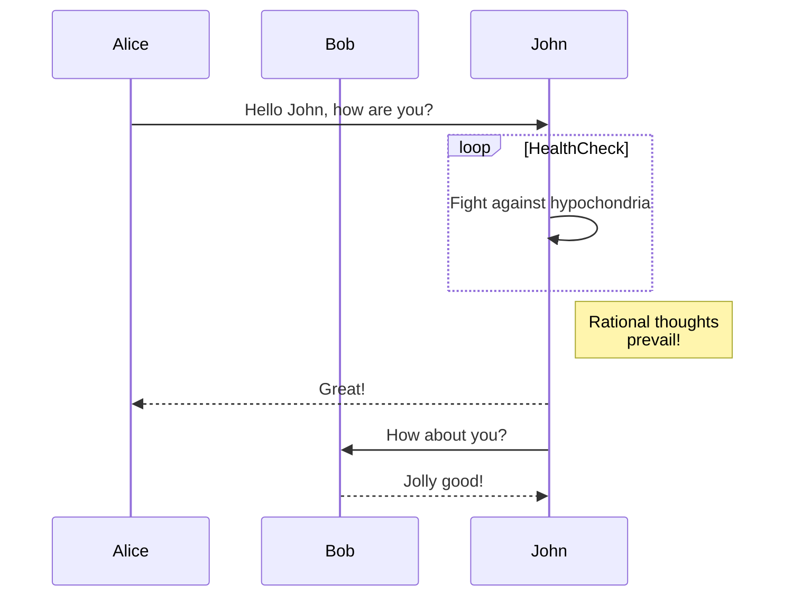
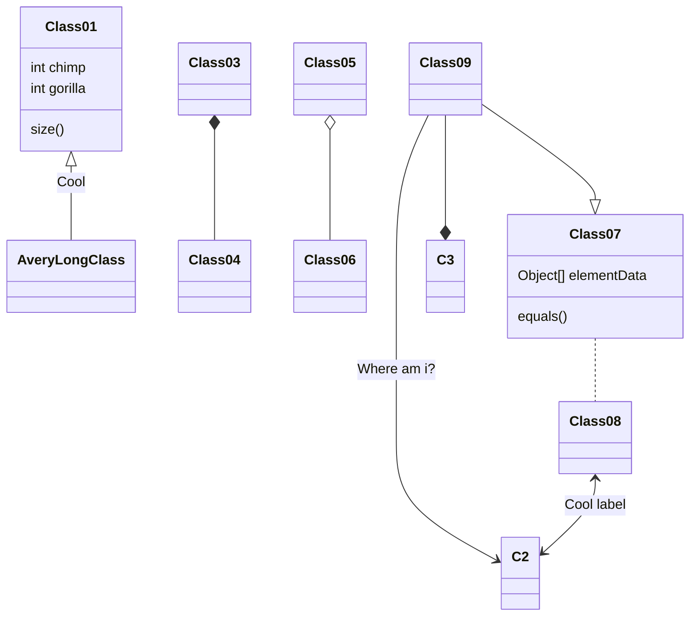
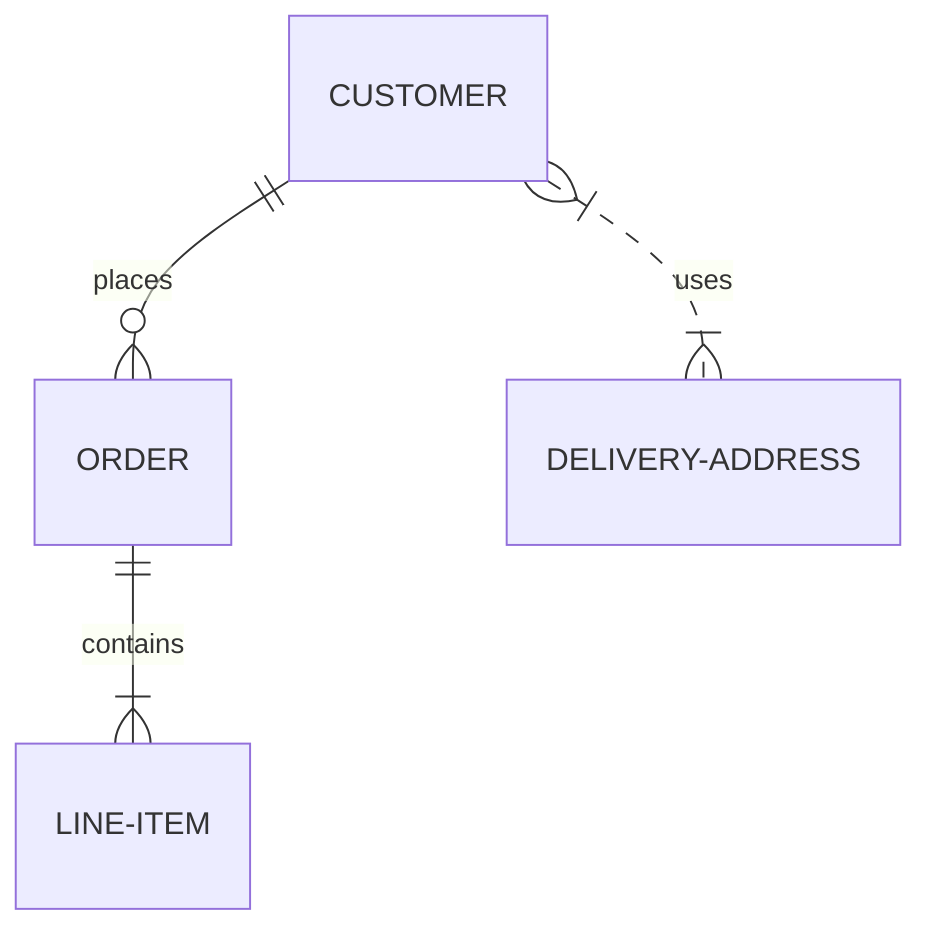

# JavaScript based diagramming and charting tool that renders Markdown-inspired text definitions to create and modify diagrams dynamically.

**Reference** https://mermaid.js.org/

## Fllowchar diagram 

## Sequence diagram

## Class diagram

## Entity Relationship diagram 
